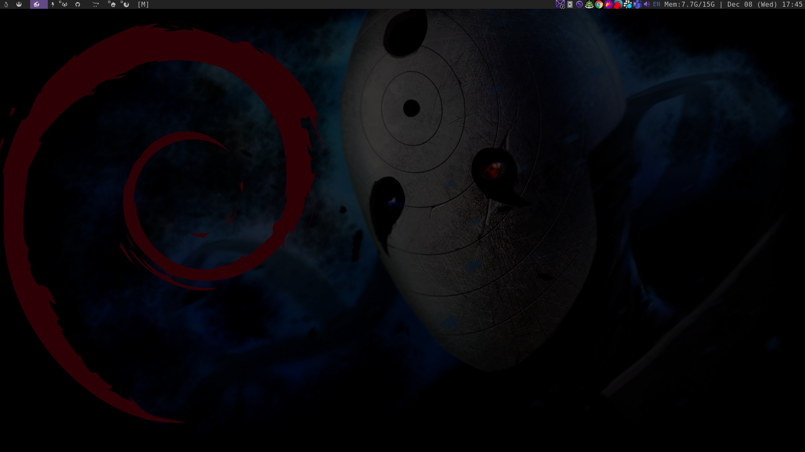

Screenshot 
## My plan is to update this as I obtain further knowledge. 
Also I figured this is a good place to put my configs so I can just install the distro and git then have my enviorment already setup.. I may eventually create an ISO for this _it will probably be debian sid_ for now it's just going to be dwm.
I'll have some different things for both debian and arch.
## For Debian:
- I use Lightdm as a login shell 
- You have to create a `.xsessionrc` file in place of a `.xprofile` file _which most people may know I had to search around and dive into comments to find this solution_

